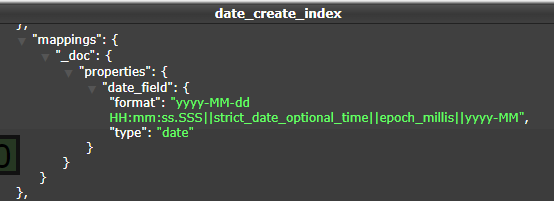

# 0、前置条件

## 0.1、ES查询结果转换
```java
    /**
     * 查询结果转换
     *
     * @param searchResponse 返回结果
     * @return List<Object>
     */
    public static List<Map<String, Object>> searchResponse2List(SearchResponse<ObjectNode> searchResponse) {

        if (searchResponse == null) {return new ArrayList<>(0);}
        if (searchResponse.hits() == null) {return new ArrayList<>(0);}
        if (CommonUtils.isCollectionEmpty(searchResponse.hits().hits())) {return new ArrayList<>(0);}

        List<Hit<ObjectNode>> hits = searchResponse.hits().hits();

        List<Map<String, Object>> list = new ArrayList<>(hits.size());
        for (Hit<ObjectNode> hit : hits) {
            ObjectNode node = hit.source();
            Map<String, Object> map = this.objectNode2Map(node);
            list.add(map);
        }
        return list;
    }

    /**
     * objectNode转Map
     *
     * @return Map<String, Object>
     */
    public static Map<String, Object> objectNode2Map(ObjectNode objectNode) {
        if (null == objectNode) {return new HashMap<>(0);}
        if (objectNode.isEmpty()) {return new HashMap<>(0);}
        ObjectMapper objectMapper = new ObjectMapper();
        return objectMapper.convertValue(objectNode, new TypeReference<Map<String, Object>>() {
        });
    }
```


# 1、类型

## 1.1、 matchAll [官网地址](https://www.elastic.co/guide/en/elasticsearch/reference/8.1/date.html)

> **Java Client**
>> 默认  
 > `Property.of(p -> p.date(d -> d))`
>
>> 配置格式化类型，  
 >  如想了解在枚举中如何动态配置properties中的配置，请移步[TODO]()
>> ```java
>> Property.of(p -> p.date(d -> d.format("yyyy-MM-dd HH:mm:ss.SSS||strict_date_optional_time||epoch_millis||yyyy-MM")
>> ```
> **Rest Api**
> ```java
> PUT /date_create_index/_mapping
> {"properties":{"date_field":{"type":"date","format":"yyyy-MM-dd HH:mm:ss.SSS||strict_date_optional_time||epoch_millis||yyyy-MM"}}}
> ```  
> **结果**  
 > 

## 1.2、 term
## 1.3、 range     范围
## 1.4、 wildcard  通配符
## 1.5、 prefix    前缀

